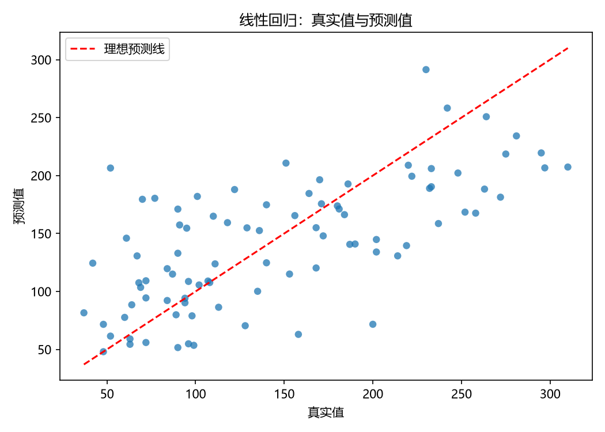
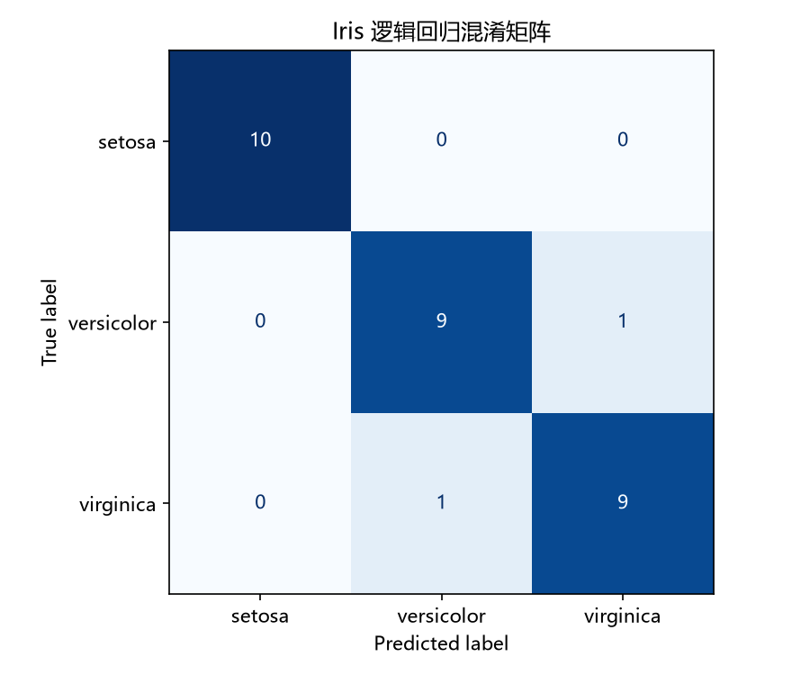
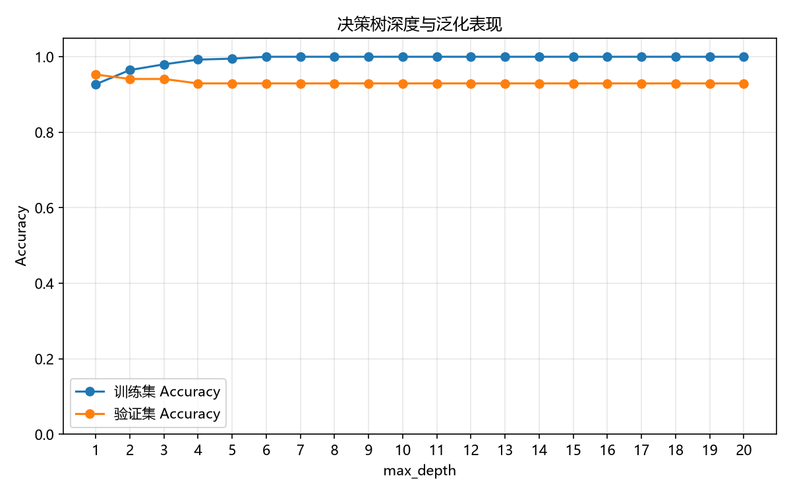
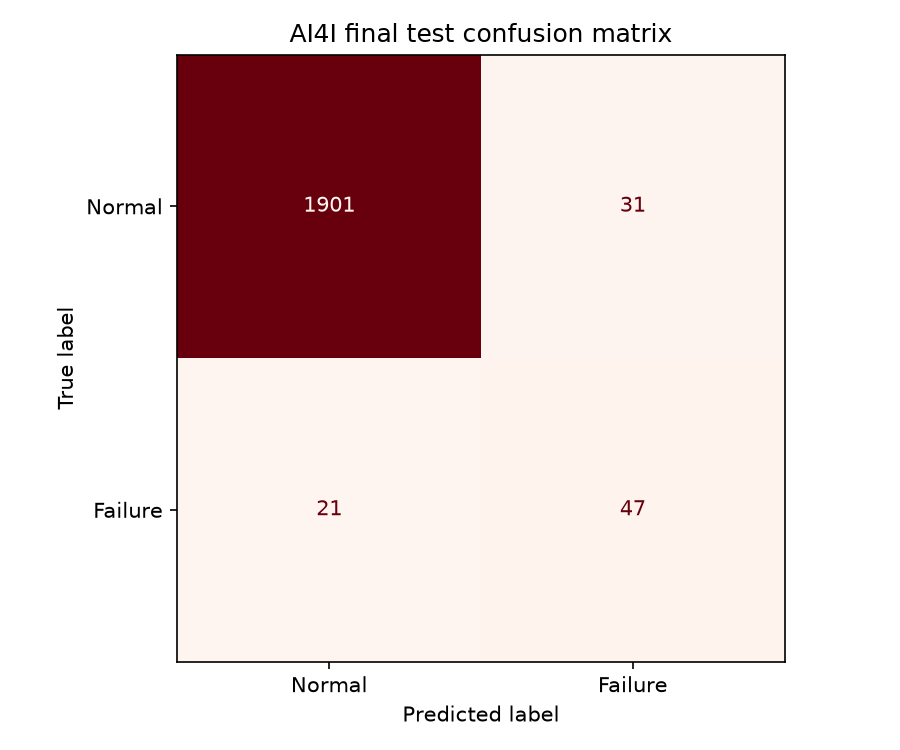
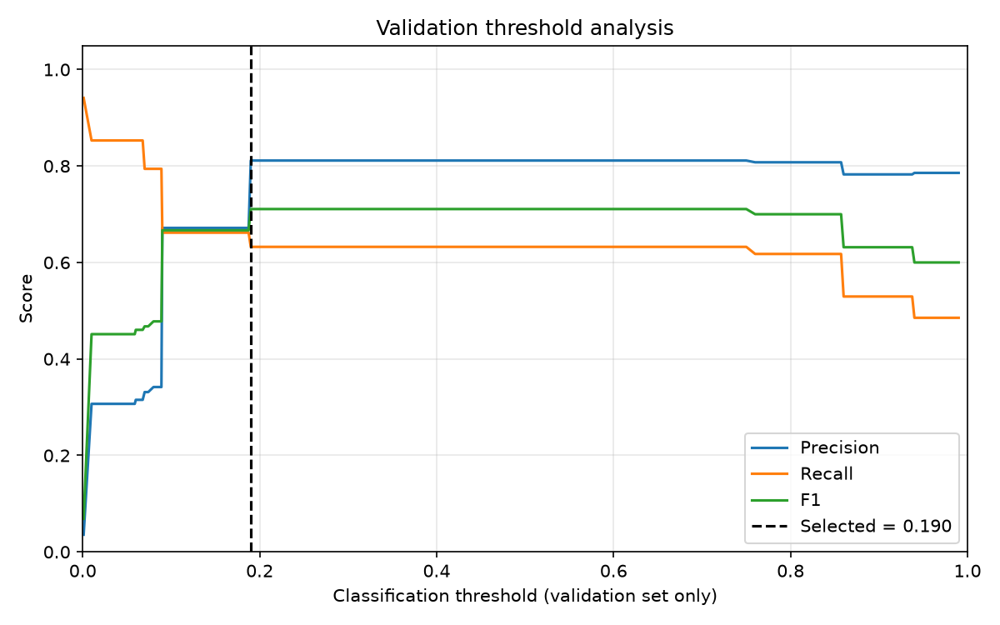
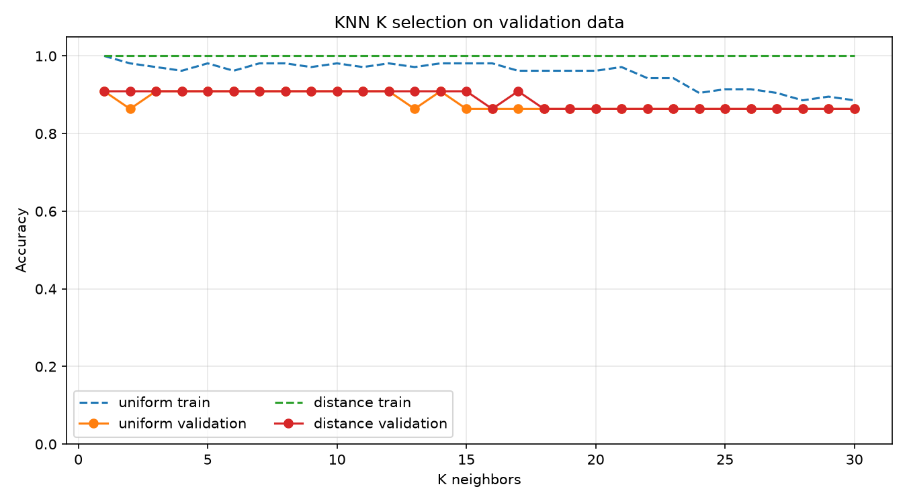
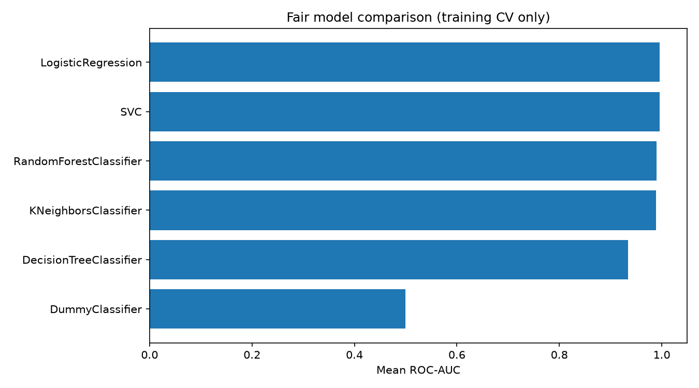
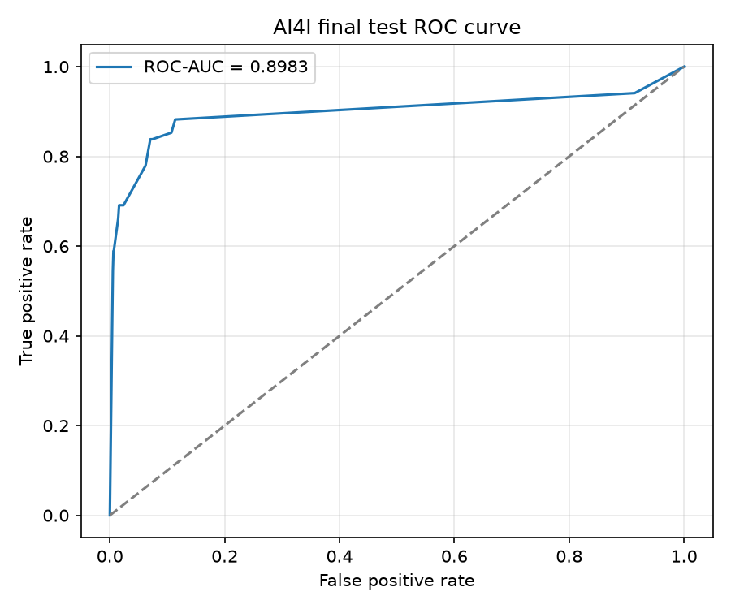

# supervised-ml-foundations

第一周监督学习（Supervised Machine Learning）项目记录。项目以 Python、物联网（IoT）和边缘计算（Edge Computing）基础为起点，通过一组小而完整的实验梳理数据、模型、评估与数据泄漏（Data Leakage）。

## 本周实践重点

- 区分特征（Feature）和标签（Label），并完成基础数据探索。
- 正确划分训练集（Training Set）、验证集（Validation Set）和测试集（Test Set）。
- 使用 `Pipeline`、`ColumnTransformer` 将预处理与模型绑定，避免数据泄漏。
- 理解回归（Regression）与分类（Classification）的常用评价指标。
- 用一个物联网故障预测案例练习可复现、可保存、可预测的最小机器学习流程。

## 学习进度与实践内容

| 日期 | 主题 | 关键产物 |
| --- | --- | --- |
| Day 1 | Iris 数据探索 | 特征、标签、缺失值与类别分布检查 |
| Day 2 | 数据划分与 Pipeline | 70/15/15 分层划分和无泄漏标准化 |
| Day 3 | 线性回归（Linear Regression） | MAE、MSE、RMSE、R² 与散点图 |
| Day 4 | 逻辑回归（Logistic Regression） | 分类报告、预测概率与混淆矩阵 |
| Day 5 | 过拟合（Overfitting） | 决策树深度选择与训练/验证曲线 |
| Day 6 | IoT 故障预测 | AI4I 数据、特征编码、模型保存与单样本预测 |

## 项目结构

```text
supervised-ml-foundations/
├── README.md
├── requirements.txt
├── .gitignore
├── LICENSE
├── src/
│   ├── common.py
│   ├── day01_iris_exploration.py
│   ├── day02_data_split_pipeline.py
│   ├── day03_linear_regression.py
│   ├── day04_logistic_regression.py
│   └── day05_overfitting.py
├── projects/
│   └── iot_failure_prediction/
│       ├── README.md
│       ├── train.py
│       └── predict.py
├── outputs/
│   ├── regression/
│   ├── classification/
│   ├── overfitting/
│   └── iot_failure_prediction/
├── tests/
│   ├── test_smoke.py
│   └── test_iot_failure_prediction.py
└── docs/
    ├── week01_notes.md
    └── learning_checklist.md
```

## 运行环境

Python 3.10 及以上版本；以下命令在仓库根目录执行：

```powershell
python -m venv .venv
.venv\Scripts\Activate.ps1
python -m pip install --upgrade pip
python -m pip install -r requirements.txt
```

若 PowerShell 禁止激活脚本，可在当前窗口临时执行 `Set-ExecutionPolicy -Scope Process Bypass`，或直接使用 `.venv\Scripts\python.exe` 运行下方命令。

## 运行命令

所有命令均从仓库根目录执行，代码仅使用相对路径保存输出。

```powershell
python src/day01_iris_exploration.py
python src/day02_data_split_pipeline.py
python src/day03_linear_regression.py
python src/day04_logistic_regression.py
python src/day05_overfitting.py
python projects/iot_failure_prediction/train.py
python projects/iot_failure_prediction/predict.py --example
python -m unittest discover -s tests -v
python -m pytest -q
```

Day 14 当前训练入口首次运行会通过 `ucimlrepo` 下载 UCI 数据集；它不需要手动放置 CSV，也不会保存下载的数据副本。

## 评价指标解释

- **MAE（Mean Absolute Error）**：平均绝对误差，越小越好。
- **MSE（Mean Squared Error）**：平方误差均值，会更严厉地惩罚大误差，越小越好。
- **RMSE（Root Mean Squared Error）**：MSE 的平方根，与目标值同量纲，越小越好。
- **R²（决定系数）**：回归拟合优度，不是分类准确率；在模型比“预测均值”更差时可以为负数。
- **Accuracy（准确率）**：所有预测中正确的比例；类别不平衡时不能单独作为结论。
- **Precision（精确率）**：预测为正类的样本中，真正为正类的比例。
- **Recall（召回率）**：真实正类中被模型识别出来的比例。
- **F1**：Precision 和 Recall 的调和平均，在两者都重要时更有参考价值。

## 数据泄漏说明

数据泄漏指训练阶段获得了预测时不应知道的信息，从而让离线指标虚高。

- Day 2 与 Day 4 将 `StandardScaler` 放进 `Pipeline`，并且只在训练集上 `fit`；验证集、测试集只做 `transform/predict`。
- Day 5 仅用验证集选择 `max_depth`，测试集只在最终模型确定后评估一次。
- Day 6 历史快照与 Day 14 当前流程均仅使用 `Type` 与五项正常运行参数；明确排除 `UDI`（题目中常写作 UID）、`Product ID`、`Machine failure` 和 `TWF/HDF/PWF/OSF/RNF` 故障模式标签。目标与故障模式信息绝不会进入特征矩阵。

## 运行结果摘要

下表记录第一周实际运行结果；Day 6 数值已移至历史快照，当前可复现的 AI4I 最终结果在 Day 14 章节。AI4I 训练入口会在首次完整运行时下载官方 UCI 数据。

| 实验 | 实际结果 |
| --- | --- |
| Day 1 | `X.shape=(150, 4)`、`y.shape=(150,)`；无缺失值；三个类别各 50 条 |
| Day 2 | 训练/验证/测试：105/22/23；验证集 Accuracy：0.8636 |
| Day 3 | MAE：42.7941；MSE：2900.1936；RMSE：53.8534；R²：0.4526 |
| Day 4 | 测试集 Accuracy：0.9333 |
| Day 5 | 最佳 `max_depth=1`；验证集 Accuracy：0.9529；最终测试集 Accuracy：0.8721 |
| Day 6 | Week 1 历史实验快照见 [week01_notes.md](docs/week01_notes.md)；它使用旧版候选流程，不能与 Day 14 当前结果直接比较。 |

## 生成图表

以下图片由脚本实际运行后生成；在首次运行完成前，这些链接不会显示结果。











Day 14 运行后会生成 `outputs/iot_failure_prediction/model_comparison.csv`、`final_test_metrics.json`、`final_model.joblib`、`decision_threshold.json`、分析图和误报/漏报 CSV。Day 6 历史流程仍保留兼容入口；完整说明见 [AI4I 项目说明](projects/iot_failure_prediction/README.md)。

## 当前限制

- 数据集规模较小，示例重点是学习流程而非追求业务部署精度。
- Day 6 历史快照已比较 Dummy、逻辑回归、决策树和随机森林；Day 14 当前流程进一步加入 KNN、SVM 和训练集内调参，仍未进行时间外推验证、概率校准或业务成本敏感阈值优化。
- 缺少线上数据质量监控、漂移检测和边缘端部署；这些不属于第一周范围。

## 下一步实践计划

1. 学习交叉验证（Cross-Validation）和网格搜索（Grid Search）。
2. 比较树模型与逻辑回归，并依据业务代价选择阈值。
3. 学习特征工程、类别不平衡处理，以及模型解释方法。
4. 将经过验证的小模型导出到边缘设备可用的推理格式。

## 数据来源与引用

- Day 1、2、4 使用 scikit-learn 内置 Iris 数据集；Day 3 使用内置 Diabetes 数据集；Day 5 使用内置 Breast Cancer Wisconsin 数据集。
- Day 6 历史快照与 Day 14 当前流程使用 [UCI AI4I 2020 Predictive Maintenance Dataset](https://archive.ics.uci.edu/dataset/601/ai4i+2020+predictive+maintenance+dataset)，通过官方 [`ucimlrepo`](https://pypi.org/project/ucimlrepo/) 包的 `fetch_ucirepo(id=601)` 获取。
- 数据集引用：Matzka, S. (2020). *AI4I 2020 Predictive Maintenance Dataset*. UCI Machine Learning Repository. DOI: [10.24432/C5HS5C](https://doi.org/10.24432/C5HS5C)。许可：[CC BY 4.0](https://creativecommons.org/licenses/by/4.0/)。

## Week 2: Model Selection and Evaluation

第二周沿用连续 14 天学习路线：

| 整体路线 | 周内编号 | 主题 | 脚本 |
| --- | --- | --- | --- |
| Day 08 | Week 2 Day 1 | K-Nearest Neighbors | `src/day08_knn.py` |
| Day 09 | Week 2 Day 2 | Decision Tree | `src/day09_decision_tree.py` |
| Day 10 | Week 2 Day 3 | Random Forest | `src/day10_random_forest.py` |
| Day 11 | Week 2 Day 4 | Support Vector Machine | `src/day11_svm.py` |
| Day 12 | Week 2 Day 5 | Cross-validation 与 GridSearchCV | `src/day12_cross_validation.py` |
| Day 13 | Week 2 Day 6 | 公平多模型比较 | `src/day13_model_comparison.py` |
| Day 14 | Week 2 Day 7 | AI4I 项目升级、复习与验收 | `projects/iot_failure_prediction/` |

Day 08 至 Day 13 均从仓库根目录运行：

```powershell
python src/day08_knn.py
python src/day09_decision_tree.py
python src/day10_random_forest.py
python src/day11_svm.py
python src/day12_cross_validation.py
python src/day13_model_comparison.py
python projects/iot_failure_prediction/train.py
```

KNN、Logistic Regression 和 SVM 将缩放封装进 `Pipeline`；树与随机森林不使用无意义的缩放器。所有分类划分固定 `random_state=42` 并分层。Day 08–Day 11 用验证集做选择，Day 12–Day 13 只在训练部分做五折 `StratifiedKFold`，测试集不会参与调参、模型选择或阈值选择。

### 已真实运行的关键结果

| 实验 | 验证 / CV 结果 | 最终独立测试结果 |
| --- | --- | --- |
| Day 08 KNN | `K=1`, `weights=uniform`，验证 Accuracy 0.9091 | Accuracy 0.9565 |
| Day 09 Tree | `max_depth=1` | Accuracy 0.8721 |
| Day 10 Forest | `n_estimators=50`, `max_features=0.5` | Accuracy 0.9070 |
| Day 12 SVM GridSearchCV | ROC-AUC 0.9964 ± 0.0049 | ROC-AUC 0.9977 |
| Day 13 排名 | 以训练 CV mean ROC-AUC 排序 | 未用测试集选模型 |
| Day 14 AI4I（当前可复现的最终结果） | 调参 CV F1 0.6841 ± 0.0476 | Accuracy 0.9740；F1 0.6438；ROC-AUC 0.8983；AP 0.5843 |

Day 13 的公平比较保留 Dummy 基线，并在相同折上报告 Accuracy、Precision、Recall、F1 和 ROC-AUC 的 mean ± std。完整表见 `outputs/model_comparison/model_comparison.csv`。

### Day 14：AI4I 综合应用

AI4I 2020 是描述工业预测性维护特征的合成数据，不是实际工厂采集的运行数据。数据仅通过 UCI 的公开 dataset id=601 获取：Matzka, S. (2020), [DOI: 10.24432/C5HS5C](https://doi.org/10.24432/C5HS5C)，[CC BY 4.0](https://creativecommons.org/licenses/by/4.0/)。

目标是 `Machine failure`；允许特征为 `Type` 与五项运行特征。`UID/UDI`、`Product ID`、`TWF/HDF/PWF/OSF/RNF` 被严格排除，后五项会泄漏故障模式。Day 14 对训练部分比较 Dummy、Logistic Regression、KNN、Decision Tree、Random Forest 和 SVM（及可用的平衡版本），只调优两个最有希望的基线候选。最终选择 `DecisionTreeClassifier`，实际参数为 `max_depth=8`、`min_samples_leaf=1`；验证集按 F1、Recall、Precision 选择阈值 0.19。







完整中文笔记见 [week02_model_selection.md](docs/week02_model_selection.md)。当前可复现的 Day 14 最终指标与产物清单以 `outputs/iot_failure_prediction/final_test_metrics.json`、同目录 CSV 和当前 `projects/iot_failure_prediction/train.py` 为准。

下一阶段计划：学习 PyTorch 与深度学习基础，包括张量、自动求导、训练循环和基础神经网络。

### Day 14 audit details

- AI4I 2020 is a **synthetic** predictive-maintenance dataset, not real factory-collected data.
- The fixed stratified split is 6,000 training rows, 2,000 validation rows, and 2,000 final-test rows.
- `GridSearchCV` and all candidate comparisons use training data/folds only. Preprocessing is fitted only on the corresponding training data.
- The `0.19` classification threshold was selected only from validation predictions; the test set was reserved for final evaluation.
- `UID/UDI`, `Product ID`, and `TWF` / `HDF` / `PWF` / `OSF` / `RNF` are excluded from `X`.
- Final output: `DecisionTreeClassifier(max_depth=8, min_samples_leaf=1)`; CV F1 `0.6841 ± 0.0476`; Accuracy `0.9740`; Precision `0.6026`; Recall `0.6912`; F1 `0.6438`; ROC-AUC `0.8983`; Average Precision `0.5843`; FP `31`; FN `21`.
- A reliable total experiment runtime was not recorded, so no elapsed-time value is claimed.
