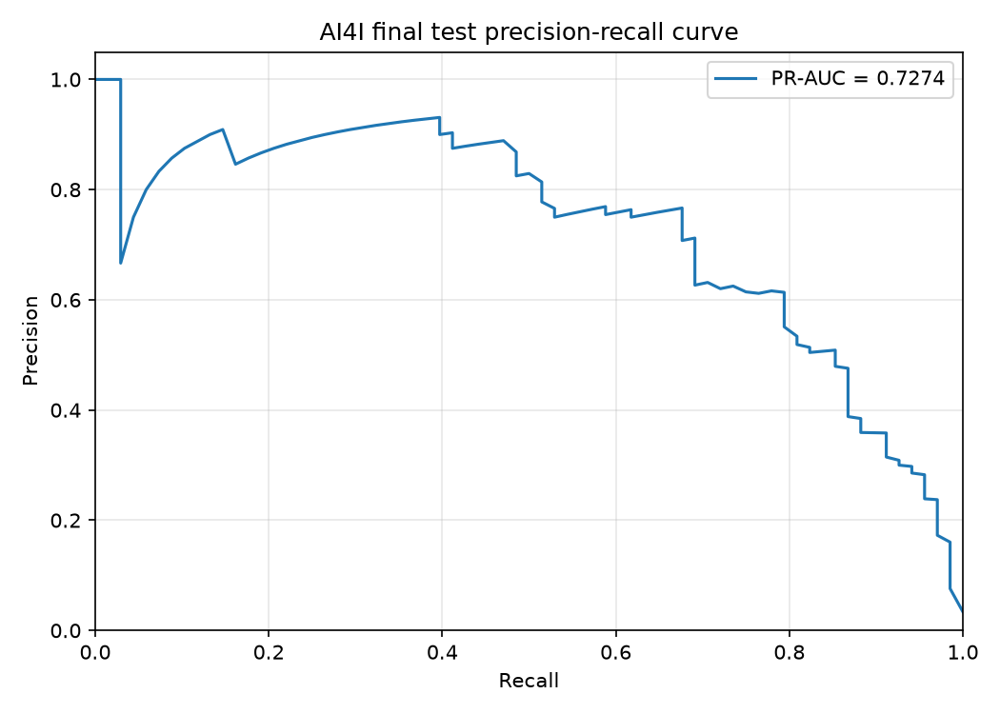
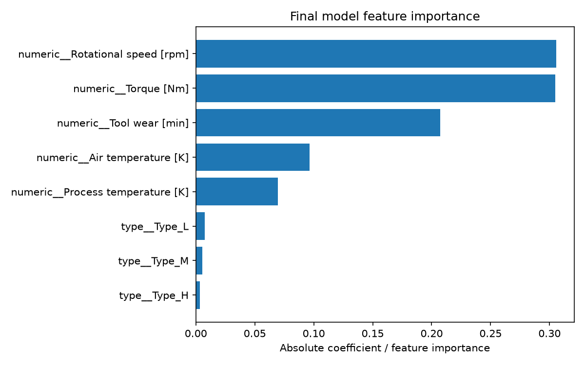

# AI4I 设备故障预测：可复现基线项目

这是 `supervised-ml-foundations` 的 Day 6 项目：以 UCI AI4I 2020 Predictive Maintenance Dataset 为基础，预测设备是否发生故障（`Machine failure`）。它关注一个适合初学者审查的完整流程：无泄漏特征、统一数据划分、多模型对比、验证集阈值选择、最终一次测试评估，以及可加载的单条预测。

## 问题定义

- **任务**：二分类（Binary Classification）。
- **目标（Label）**：`Machine failure`，`1` 为故障，`0` 为正常。
- **关注重点**：故障是少数类，不能只看 Accuracy（准确率）；应重点观察故障类的 F1、Recall 和 PR-AUC。
- **固定随机种子**：`random_state=42`。

## 数据来源与许可

训练脚本使用官方 `ucimlrepo` 包下载数据，不要求手动放置 CSV，也不将原始数据副本保存到仓库：

```python
from ucimlrepo import fetch_ucirepo
dataset = fetch_ucirepo(id=601)
```

Matzka, S. (2020). *AI4I 2020 Predictive Maintenance Dataset*. UCI Machine Learning Repository. DOI: [10.24432/C5HS5C](https://doi.org/10.24432/C5HS5C)。许可：[CC BY 4.0](https://creativecommons.org/licenses/by/4.0/)。

## 合成数据限制

自动化测试使用小型合成记录，仅用来验证数据边界、Pipeline、模型/阈值保存加载和预测输入检查。它不用于训练展示模型，不产生报告指标，也不能代表 AI4I 数据分布。所有 `outputs/iot_failure_prediction/` 中的指标、图表和错误样本必须由真实 UCI 数据运行 `train.py` 后生成。

## 特征与目标

允许进入特征矩阵的列严格只有六项：

| 类型 | 字段 | 预处理 |
| --- | --- | --- |
| 类别 | `Type` | `OneHotEncoder(handle_unknown="ignore")` |
| 数值 | `Air temperature [K]` | `StandardScaler` |
| 数值 | `Process temperature [K]` | `StandardScaler` |
| 数值 | `Rotational speed [rpm]` | `StandardScaler` |
| 数值 | `Torque [Nm]` | `StandardScaler` |
| 数值 | `Tool wear [min]` | `StandardScaler` |

目标只来自 `Machine failure`，不被加入 `X`。

## 数据泄漏防范

以下字段被显式排除，且测试会检查它们不在特征配置中：

- `UDI`（数据集实际使用的 Unique Identifier；`UID` 同义写法也被禁止）
- `Product ID`
- `Machine failure`
- `TWF`、`HDF`、`PWF`、`OSF`、`RNF`

`TWF/HDF/PWF/OSF/RNF` 是故障模式标签；把它们用于预测总故障会直接泄漏目标信息。`Pipeline` 将预处理与分类器绑定，因此每个交叉验证折只在本折训练数据上拟合 `StandardScaler` 和 `OneHotEncoder`。

## 统一划分与类别不平衡

脚本先使用分层划分（Stratified Split）固定为：

```text
全量数据
├── 训练集 60%：仅在这里做 StratifiedKFold(n_splits=5) 模型比较
├── 验证集 20%：仅为选中模型分析分类阈值
└── 测试集 20%：只在最终模型和阈值确定后评价一次
```

除 `DummyClassifier` 基线外，逻辑回归、决策树和随机森林各比较普通训练与 `class_weight="balanced"` 训练。平衡权重会提高少数故障类的训练影响；它可能提高 Recall，也可能带来更多误报，因此必须结合 F1、PR-AUC 与错误分析判断。

## 模型比较与评价指标

训练集上以固定种子的 5 折 `StratifiedKFold` 比较：

1. `DummyClassifier`：只反映基线水平。
2. `LogisticRegression` 与 `LogisticRegression(class_weight="balanced")`。
3. `DecisionTreeClassifier` 与平衡版本。
4. `RandomForestClassifier` 与平衡版本。

每个候选模型报告交叉验证均值和标准差：

- Accuracy、Precision、Recall、F1：以 `Machine failure=1` 为正类。
- ROC-AUC：不同阈值下的排序能力。
- PR-AUC（Average Precision）：更适合正类稀少时比较故障识别能力。

最终模型从非 Dummy 候选中按交叉验证 **F1 → Recall → PR-AUC** 的顺序确定。实际表格将保存到 [`model_comparison.csv`](../../outputs/iot_failure_prediction/model_comparison.csv)。

### 本次真实运行结果

在固定 `random_state=42`、训练集 6,000 条记录的 5 折交叉验证中，以下为故障正类的平均指标。完整六项指标和标准差见 [`model_comparison.csv`](../../outputs/iot_failure_prediction/model_comparison.csv)。

| 模型 | class_weight | F1 | Recall | PR-AUC |
| --- | --- | ---: | ---: | ---: |
| RandomForestClassifier | balanced | 0.6313 | 0.5809 | 0.7078 |
| DecisionTreeClassifier | balanced | 0.6260 | 0.6057 | 0.4086 |
| DecisionTreeClassifier | none | 0.6195 | 0.6301 | 0.4007 |
| RandomForestClassifier | none | 0.5937 | 0.4479 | 0.7541 |
| LogisticRegression | none | 0.3015 | 0.1970 | 0.4692 |
| LogisticRegression | balanced | 0.2344 | 0.7935 | 0.4389 |
| DummyClassifier | none | 0.0000 | 0.0000 | 0.0338 |

平衡随机森林以最高 CV F1（0.6313）被选为最终模型；相较非平衡随机森林，它以较低 Precision 换取更高 Recall，并更符合本项目对故障类的关注重点。

## 阈值选择

模型默认的 0.5 阈值不一定适合故障业务。脚本仅对选中模型的验证集概率扫描候选阈值，并按 **F1 → Recall → Precision** 的顺序选择。测试集完全不参与阈值选择。

阈值及其来源保存在 `decision_threshold.json`；`predict.py` 使用这个保存的值，而非重新假定 0.5。验证集阈值表保存为 `validation_threshold_analysis.csv`。

本次验证集将阈值从 0.50 调整为 **0.47**：F1 从 0.6129 提升至 0.6562，Recall 从 0.5588 提升至 0.6176。该选择发生在测试集评价之前。

## 错误分析

最终测试集只预测一次，随后输出：

- `false_positives.csv`：误报（正常却预测为故障）。
- `false_negatives.csv`：漏报（故障却预测为正常）。
- `error_analysis.md`：根据这两类真实样本统计的平均温度、转速、扭矩、磨损和设备类型分布。

该摘要只描述模型错误样本的典型特征，不能据此作因果结论。真实运行后再阅读它，避免把假设当作实验结论。

本次最终测试集共有 14 条误报和 23 条漏报。误报主要为 `Type=L`（10/14），平均转速 1687.29 rpm、扭矩 42.59 Nm；漏报中 `L/M` 类型分别为 11/10，平均转速 1447.52 rpm、扭矩 48.24 Nm、工具磨损 142.78 min。完整记录和原始统计请以对应 CSV 与 [`error_analysis.md`](../../outputs/iot_failure_prediction/error_analysis.md) 为准。

### 最终测试集（一次评价）

| Accuracy | Precision | Recall | F1 | ROC-AUC | PR-AUC |
| ---: | ---: | ---: | ---: | ---: | ---: |
| 0.9815 | 0.7627 | 0.6618 | 0.7087 | 0.9741 | 0.7274 |

测试集共 2,000 条记录，其中 68 条为故障。该表和所有图表均由实际运行生成，未用于模型或阈值选择。

## 运行命令

在仓库根目录、已安装依赖的虚拟环境中执行：

```powershell
python projects/iot_failure_prediction/train.py
python projects/iot_failure_prediction/predict.py --example

python projects/iot_failure_prediction/predict.py `
  --type L `
  --air-temperature 298.1 `
  --process-temperature 308.6 `
  --rotational-speed 1551 `
  --torque 42.8 `
  --tool-wear 120

python -m unittest discover -s tests -v
python -m pytest -q
```

`predict.py` 会检查：必填字段、`Type` 是否为 `L/M/H`、温度是否在合理开尔文范围内、转速/扭矩是否为正数、工具磨损是否非负。错误输入会给出明确的字段级提示。

## 真实运行产物与图表

运行 `train.py` 后，所有以下文件都会在 `outputs/iot_failure_prediction/` 生成：

| 产物 | 含义 |
| --- | --- |
| `model_comparison.csv` | 训练集 5 折模型对比表 |
| `metrics.json` | 数据划分、CV 对比、验证阈值和最终一次测试指标 |
| `final_model.joblib` | 用训练集与验证集重训的最终 Pipeline |
| `decision_threshold.json` | 只由验证集选择的阈值 |
| `confusion_matrix.png` | 最终测试集混淆矩阵 |
| `precision_recall_curve.png` | 最终测试集 PR 曲线 |
| `threshold_analysis.png` | 验证集阈值分析图 |
| `feature_importance.png` | 最终非 Dummy 模型的重要特征 |
| `false_positives.csv`、`false_negatives.csv` | 最终测试集错误样本 |
| `error_analysis.md` | 错误样本特征摘要 |

图表链接会在真实训练后显示：







## 局限性与下一步计划

- AI4I 是教学/合成型预测维护数据集，指标不能直接外推到真实产线；真实设备还会受传感器漂移、维护策略和采样偏差影响。
- 当前以固定一次训练/验证/测试切分展示流程，不等同于跨工厂、跨时间或跨设备的外部验证。
- 特征重要性反映模型关联，不代表故障原因。
- 后续可加入按时间或设备分组的验证、业务代价敏感阈值、概率校准、特征工程，以及边缘端推理资源测量。
